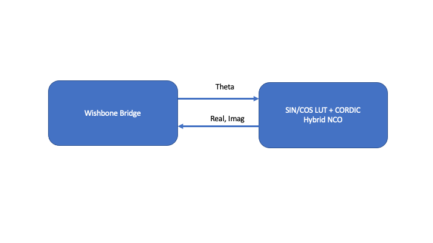

# NCO

This design implements an NCO using a hybrid LUT+CORDIC implementation. User can use the wishbone bus on the caravel harness to send theta values and read Real(X) Imaginary(Y) values

# License

This project is [licensed under Apache 2](LICENSE)
